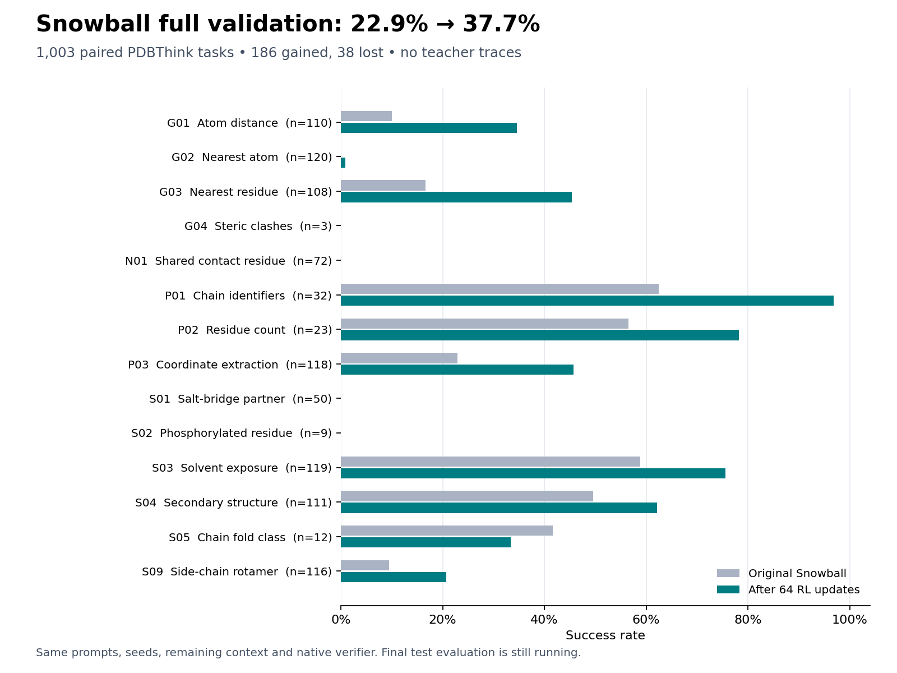

# PDBThink coordinate RL

[Issue #1](https://github.com/timodonnell/snowball-post-training/issues/1).
Train Snowball directly against PDBThink's native verifier with Marin's artifact
launcher, MarinSkyRL, Megatron, vLLM, and Iris on CoreWeave. No GLM responses or
other teacher traces are used.

## Status

The [full-pass continuation](https://wandb.ai/timodonnell/snowball-pdbthink/runs/ppc4ryud)
launched October 8 on **48 CoreWeave H100s**. It restores the pilot's step-64
policy, optimizer, scheduler, and dataloader position and targets step 876:
812 additional updates, completing the first 876 full batches of the training
pool (28,032 prompts; the final incomplete 13-task batch is omitted upstream).
The allocation and training geometry match the successful pilot. The training
limit is 96 hours and the coordinator limit is 120 hours, including export.

Scale-up evaluates **all 1,003 validation tasks every 64 updates**, plus the
starting and terminal policies. It banks every evaluated checkpoint using native
pending HF export requests. `finish_run.py --select-validation` selects the highest
full-validation task-weighted accuracy, breaking ties by family macro accuracy
and then earlier step; the starting pilot checkpoint is also eligible. Selection
is saved before the paired 1,370-task test. Test scores do not influence selection.
The observer verifies terminal publication even if worker teardown stalls, exports
the selected checkpoint with the native MarinSkyRL exporter, and runs the paired
standalone validation/test comparisons. Progress is saved in
`runs/001/epoch-v1-followup-status.json`; full-validation latest/best summaries go
to W&B. This is a detached local observer, not an app notification service.

The [64-update pilot](https://wandb.ai/timodonnell/snowball-pdbthink/runs/xlyyl24u)
completed training successfully on 48 CoreWeave H100s. All six training tasks
exited successfully, the final checkpoint and HF export are saved, and the
training GPUs are released. This pilot sampled at most 2,048 prompts from the
28,045-task pool; it was not a full epoch.

| Measurement | Original Snowball | Trained | Change |
| --- | ---: | ---: | ---: |
| Pilot fixed monitor (107 validation tasks) | 21/107 (19.63%) | 32/107 (29.91%) | +10.28 pp |
| Two-update smoke, full validation | 230/1,003 (22.93%) | 242/1,003 (24.13%) | +1.20 pp |
| Pilot full validation | 230/1,003 (22.93%) | 378/1,003 (37.69%) | +14.76 pp |
| Pilot paired test | Pending | Pending | Pending |

The completed pilot full validation gained 186 correct answers and lost 38.
Family-macro accuracy rose from 23.44% to 35.25%. Atom-distance questions improved
from 10.0% to 34.5%, nearest-residue questions from 16.7% to 45.4%, coordinate
extraction from 22.9% to 45.8%, and solvent exposure from 58.8% to 75.6%.
G04, N01, S01 and S02 remain at zero; G02 is 1/120. Chain fold classification
fell from 5/12 to 4/12. Format errors fell from 419 to 256, while context-limit
truncations increased from 138 to 189. The paired test is running separately.



See [`results/pilot-validation-comparison.json`](results/pilot-validation-comparison.json)
for the complete paired counts and per-family results.

The pilot monitor is a small, repeatedly observed development panel. Its largest
count gains were S03 (4 to 7 of 8), S04 (2 to 4 of 8), and S09 (1 to 3 of 8).
All 107 final monitor rewards replay exactly through the frozen native verifier.
The smoke's full validation gain is modest (107 newly correct, 95 newly incorrect).
Do not compare absolute scores between the native monitor and standalone serving
as if they were the same measurement. See [`results/pilot-monitor.json`](results/pilot-monitor.json)
and [`results/smoke-validation-comparison.json`](results/smoke-validation-comparison.json).

Pilot full validation (1,003 tasks) and the paired final test (1,370 tasks) restarted
on October 8 using the preselected step-64 checkpoint. Export publication finished
at 04:06 UTC, but an Iris worker disappeared during shutdown, leaving the export
job pending and the coordinator waiting. Recovery verified successful training,
the terminal checkpoint marker, all 45 published file sizes including 39 weight
shards, metadata checksums, and unchanged tokenizer/template. The stale export
job and coordinator were cancelled. `finish_run.py --recover-step 64` records
separate recovery provenance instead of fabricating native terminal success.
The evaluation uses one eight-H100 server at a time and releases each server
on completion or failure. W&B's crashed label reflects logger shutdown;
Iris training succeeded. The native terminal monitor is preserved separately.

Auditing the smoke found one under-reward among 256 training responses:
SkyRL stripped a thinking block before verification, whereas the benchmark and
standalone evaluator score original API content. Adapter v3 scores that original
content consistently; all 470 retained smoke responses passed replay through the
corrected installed environment. See `results/adapter-v3-replay.json` for the
single correction and `runs.json` for run IDs and durable result locations.

## Frozen inputs

| Input | Revision |
| --- | --- |
| `open-athena/Snowball-67B-A2B-5.7T-Mixed-RLVR-Step38` | `cfc1d845dae89b067cdc7250d0164abefa5a69cf` |
| `open-athena/pdbthink-coordinate-tasks` v1.3.0 | `3734406cb97b1702844319f9a5d860cbbf8fe660` |
| `marin-community/marin` | `44c95a7914864fdab8b74d597052e30cbc92b8cc` |
| `marin-community/MarinSkyRL` | `5663f6129f53bb6aaa09549fa6cb423571503e94` |

`cohort_manifest.json` records the parquet, tokenizer, template, verifier, and
cohort checksums. The full ID list is in the prepared artifact's `cohort.json`.
Preparation verifies the release checksums, joins the context table on task path
and prompt hash, and re-tokenizes every selected prompt using the pinned native
template with thinking enabled. Eligible tasks have at least 8,192 tokens left
in Snowball's 32,768-token context. Published splits and source groups remain
intact and disjoint:

| Split | Tasks | Purpose |
| --- | ---: | --- |
| Train | 28,045 | RL pool |
| Validation | 1,003 | Development and checkpoint selection |
| Test | 1,370 | Reserved final comparison |
| Monitor | 107 | Fixed subset of validation, at most eight per family |
| Smoke | 32 | Training subset covering 18 families and long prompts |

Validation covers 14 families. It has no T01, S06, I01, S07, or S08 examples;
do not infer held-out performance on these families. The manifest gives exact
counts for each split and family. Test covers 16 families, including S07 (three
tasks) and S08 (50 tasks); it has no T01, S06, or I01 examples.

Durable prepared input prefix:
`s3://marin-us-east-02a/marin/bizon/snowball-pdbthink/inputs/2026.10.07-v3`.
Model mirror prefix:
`s3://marin-us-east-02a/marin/bizon/snowball-pdbthink/models/cfc1d845dae89b067cdc7250d0164abefa5a69cf`.
The model mirror writes `source.json` only after all files pass size and SHA256
checks. The launcher requires that readiness manifest before allocating GPUs.

## Reward and evaluation

The model receives only `prompt.json`'s original system and user messages. Gold
answers are environment extras. No solution archive is read. No tools are
executed; structured requests explicitly disable tools. The pinned task's
`tests/coordinate_scoring` implementation decides exact `FINAL:` correctness,
including v1.3.0's inclusive numeric tolerance. Reward is binary correctness;
partial set scores are diagnostics only. Truncation, refusal, tool calls, and
oversized responses receive zero reward.

Training samples four responses per prompt at temperature 1.0 with an 8,192-token
output cap. **Evaluation uses the full remaining context**, `32768 - input_tokens`,
temperature 0, top-p 1, and one response per task. The 8K cohort reserve is not an
evaluation cap. Baseline and trained evaluations must use identical tasks and
this same budget policy. Raw responses, termination evidence, token counts,
format failures, and verifier diagnostics are retained. Transient HTTP/service
failures receive at most three identical requests with the same seed and budget;
model answers and verifier failures are never retried.

Training logs `reward/domain/<encoded-family>/avg_raw_reward` (for example,
`G01` is `_source__4701` in MarinSkyRL). `monitor.py` decodes these to family IDs
and exports overall sampled success, pass@4, loss, and gradient norm. These are
training-batch statistics. The fixed validation panel
logs `eval/<family>/avg_score` and `eval/<family>/pass_at_1` to W&B project
`timodonnell/snowball-pdbthink`. `monitor.py` produces task-weighted and family
macro curves with coverage. Monitor accuracy is a development signal, not the
full validation or test result. `evaluate.py` runs resumable full held-out
comparisons against an OpenAI-compatible endpoint and checks the server's prompt
token count against the frozen native count.

## Training configuration

`launch.py` is the configuration source and uses `@rl_build_options`. The explicit
role plan requests four eight-GPU Megatron policy nodes (TP1, PP2, EP16) on
`cw-rno2a`. Smoke adds one eight-GPU vLLM rollout node (40 H100s total); pilot adds
two (48 H100s total), each DP8/EP8. Generation dominated the measured smoke
steps, so pilot adds inference capacity with the same policy geometry. Each node requests
64 CPUs, 1,800 GB host RAM, and 1,000 GB disk, following MarinSkyRL's Snowball
Megatron recipe. Policy EP16 and 256-token log-probability chunks provide more
memory headroom after the EP8 smoke exhausted memory on its second long-context
update. The current pinned runtime supports Megatron for this model.

GRPO uses learning rate 1e-6, 32 prompts per update, four samples per prompt,
microbatch size one, gradient checkpointing, optimizer offload during rollout,
and no KL/reference model. Smoke runs two updates; pilot runs at most 64 updates
drawn from the full training pool. The optional `epoch` scale permits 876 full
batches; upstream batching may omit the final incomplete batch. A pilot does
not imply every training task has been visited.

Validation runs before training, every eight pilot updates, and at completion.
Smoke evaluates at step two. Pilot evaluation submits the complete monitor panel
in one batch to avoid repeatedly waiting for long responses in small batches.
Pilot checkpoints follow the same interval, with two
resume checkpoints retained and a terminal Hugging Face export. The epoch run
banks every 64-step checkpoint plus its terminal checkpoint for validation
selection; pending native export requests protect these candidates from rolling
retention. Only the terminal and selected models require GPU conversion. Temporary
training/trajectory artifacts follow Marin's 14-day TTL; preserve any needed
raw traces before expiry. Final exports and terminal metadata use the durable
Marin artifact prefix.

`adapter.py` is a small, checksum-pinned runtime overlay because the current
MarinSkyRL environment registry has no external plugin setting. It bundles the checksum-verified native chat template, registers
`PDBThinkEnv`, and preserves an explicitly disabled tool list in structured chat
transport. Training, loss, model, placement, and checkpoint logic remain in the
pinned upstream runtime. The exact overlay SHA256 is
`6fa472524ddea6e042905f87615f83a07fd5fee6339bd0d9f48cae5956fbc969`.

## Reproduce

From the repository root, install local preparation/evaluation tools:

```bash
uv sync --extra operations
export PYTHONPATH=experiments/001-pdbthink-coordinate
hf download open-athena/pdbthink-coordinate-tasks --repo-type dataset \
  --revision 3734406cb97b1702844319f9a5d860cbbf8fe660 --local-dir data/tasks
hf download open-athena/Snowball-67B-A2B-5.7T-Mixed-RLVR-Step38 \
  --revision cfc1d845dae89b067cdc7250d0164abefa5a69cf \
  --include '*.json' '*.jinja' --local-dir data/model-metadata
uv run python -m snowball_pdbthink.prepare --dataset data/tasks \
  --model-metadata data/model-metadata --output data/pdbthink-001
uv run python -m snowball_pdbthink.adapter build --prepared data/pdbthink-001
uv run pytest -q
```

Use a pinned Marin checkout with its CPU dependencies installed. `run_marin.py`
verifies its revision and copies this experiment into its packaged workspace.
It can use an existing compatible Marin Python environment via `--python`.

```bash
git clone https://github.com/marin-community/marin.git data/marin
git -C data/marin checkout 44c95a7914864fdab8b74d597052e30cbc92b8cc
uv sync --project data/marin --extra cpu
```

Stage data using a Marin environment (which supplies `rigging`) and mirror the
model using local operations dependencies. For a shared model cache, supply
`--model-cache /path/to/cache --keep-cache`; otherwise shards are removed from
the download cache after successful upload. `coreweave.py` supplies the existing
CoreWeave task credentials to a child command without printing or saving them.

```bash
uv run python -m snowball_pdbthink.coreweave --kubeconfig "$KUBECONFIG" -- \
  data/marin/.venv/bin/python -m snowball_pdbthink.stage \
  --prepared data/pdbthink-001 \
  --data-uri s3://marin-us-east-02a/marin/bizon/snowball-pdbthink/inputs/2026.10.07-v3
uv run python -m snowball_pdbthink.coreweave --kubeconfig "$KUBECONFIG" -- \
  .venv/bin/python -m snowball_pdbthink.stage \
  --model-uri s3://marin-us-east-02a/marin/bizon/snowball-pdbthink/models/cfc1d845dae89b067cdc7250d0164abefa5a69cf
```

First plan without `--run`. Append `--run` to submit through the Marin Iris hub.
The command below plans the corrected pilot; `smoke-launch.yaml` preserves the
actual adapter-v2 smoke configuration.
Only launch `--scale pilot` after the smoke advances optimizer steps and produces
its checkpoint/export. Use a fresh immutable calendar version for a changed run.

```bash
uv run python experiments/001-pdbthink-coordinate/run_marin.py \
  --marin data/marin --python data/marin/.venv/bin/python \
  --version 2026.10.07.1 --scale pilot \
  --data-uri s3://marin-us-east-02a/marin/bizon/snowball-pdbthink/inputs/2026.10.07-v3 \
  --model-uri s3://marin-us-east-02a/marin/bizon/snowball-pdbthink/models/cfc1d845dae89b067cdc7250d0164abefa5a69cf \
  --adapter-sha256 6fa472524ddea6e042905f87615f83a07fd5fee6339bd0d9f48cae5956fbc969
```

Inspect the coordinator and its child jobs using `iris --cluster=marin job
describe JOB_ID` and `iris --cluster=marin job logs JOB_ID`. Export the monitor
curve with the W&B run ID recorded in `runs.json`:

```bash
uv run python -m snowball_pdbthink.monitor \
  --run timodonnell/snowball-pdbthink/RUN_ID \
  --manifest data/pdbthink-001/manifest.json --output runs/001/monitor.json
uv run python -m snowball_pdbthink.evaluate \
  --tasks data/pdbthink-001/validation.parquet \
  --verifier data/pdbthink-001/native_verifier \
  --base-url http://MODEL_ENDPOINT/v1 --model SERVED_MODEL_NAME \
  --model-identity EXACT_CHECKPOINT_ID --output runs/001/validation-CHECKPOINT_ID
```

For a dedicated held-out server, use `run_marin.py --module
experiments.snowball_pdbthink.serve_evaluation --model-uri CHECKPOINT_URI --name
UNIQUE_NAME`, with the same `--marin` and `--python` arguments. This requests
eight H100s, runs the pinned Marin vLLM fork with TP1/DP8/EP8, and stops after
four hours. Its loader uses four readers and a 120-second S3 low-throughput
window, following observed model-load timeouts. These settings must match for
baseline and trained checkpoints. The base fork currently resolves to
`01911be34fac` in the pinned Marin runtime.

Use `run_marin.py --module experiments.snowball_pdbthink.evaluate_iris` with
`--endpoint /serve/UNIQUE_NAME`, absolute `--tasks`, `--verifier`, `--output`, and
`--model-identity` paths/identity. It waits for readiness and keeps its scoped
Iris capability in process memory. It never prints or saves that capability.
Stop the dedicated server after evaluation with `iris --cluster=marin job cancel
/bizon/UNIQUE_NAME`; a completed evaluator does not itself stop the server.

Use different output directories for baseline and trained checkpoints. Record
the selected checkpoint before evaluating test; report all family counts,
macro and task-weighted accuracy, coverage, formatting, truncation, and token
usage. Sparse monitor gains alone are insufficient to claim improvement.

Compare complete paired runs with `python -m snowball_pdbthink.compare --baseline
BASELINE_DIR --trained TRAINED_DIR --output runs/001/comparison.json`. The
comparison rejects mismatched task IDs, cohort fingerprints, metadata, or
per-task generation requests. It reports accuracy deltas and paired gains/losses
by family; these are descriptive results, not a statistical significance claim.

Audit downloaded MarinSkyRL trajectory archives with `python -m
snowball_pdbthink.audit_rollouts --tasks PREPARED_SPLIT.parquet --verifier
PREPARED/native_verifier --archives
ARCHIVE.zip ... --output AUDIT.json`. This checks runtime prompts, native token
counts, context limits, binary rewards, and generation failures, and replays
the native verifier against the
frozen inputs. Use `monitor.parquet` for monitor traces and the relevant training
parquet for training traces.

`finish_run.py` waits for a successful terminal export, starts the same Marin
evaluation server used for the baseline, evaluates the complete validation
cohort, cancels the serving job in a `finally` block, and saves a paired
comparison plus raw responses to an immutable CoreWeave results prefix. It
rejects a failed training coordinator before allocating evaluation GPUs. An
optional `--wandb-run entity/project/id` adds the full held-out results to that
run's summary. By default it leaves the test split reserved. For the final pilot,
`--test-tasks PREPARED/test.parquet --test-baseline-model-uri ORIGINAL_MODEL_URI`
also evaluates the frozen baseline and the preselected terminal checkpoint on
test. It records the checkpoint selection before making any test predictions,
reuses the trained validation server for its test evaluation, and releases that
server before starting the test baseline. Smoke runs never use this option.

Run it through `coreweave.py` and `run_marin.py --module
experiments.snowball_pdbthink.finish_run`, supplying `--terminal-uri`,
`--coordinator`, a fresh `--server-name`, absolute `--tasks`, `--verifier`,
`--baseline`, `--output`, and an immutable `--results-uri`. Keep this local
follow-up process alive while training runs. Progress is written beside the
output directory as `OUTPUT-status.json`; final artifacts are in `OUTPUT`.
Evaluation can resume completed task files with a fresh serving job name.

### Full-pass continuation

The original pilot checkpoint is an explicit artifact dependency. The launch and
follow-up commands are saved locally under `runs/001/epoch-v1-*-command.json`.
To inspect its full-validation history:

```bash
uv run python -m snowball_pdbthink.monitor \
  --run timodonnell/snowball-pdbthink/ppc4ryud \
  --manifest data/pdbthink-001-v3/manifest.json --cohort validation \
  --output runs/001/epoch-v1-monitor.json
```

[`epoch-launch.yaml`](epoch-launch.yaml) records the planned source recipe;
[`results/epoch-resolved-launch.json`](results/epoch-resolved-launch.json) records
the actual native preflight result and job geometry. Reruns need a fresh artifact
version and explicit checkpoint selection.
