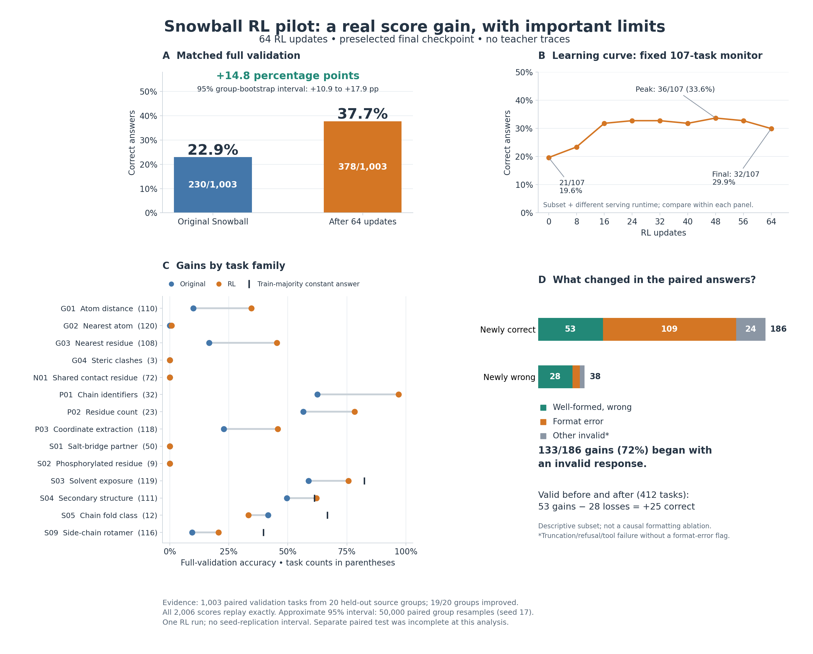

# What the Snowball RL pilot establishes

Analysis snapshot: October 8, 2026. The separate paired test is still incomplete.

**The pilot substantially improved measured validation performance. Evidence for
new geometric reasoning is considerably narrower:** many gains involve producing
an acceptable answer, and categorical scores remain close to or below simple
class-prior controls. This is useful task adaptation after 64 GRPO updates, but
does not establish a general advance in molecular reasoning.



[Vector PDF](pilot-evidence.pdf) · [Audited data](pilot-evidence.json) ·
[Paired comparison](pilot-validation-comparison.json)

## The measured gain is substantial

The same 1,003 validation prompts were evaluated before training and at the
preselected final step-64 checkpoint. Correct answers increased from **230
(22.93%) to 378 (37.69%)**, a **14.76 percentage-point** gain. There were 186 newly
correct answers, 38 newly wrong answers, 192 correct under both models, and 587
wrong under both. Family-macro accuracy also increased, from 23.44% to 35.25%.

These tasks represent **20 source groups**, not 1,003 independent structures.
Nineteen groups improved and one regressed. An approximate 95% paired
source-group bootstrap interval for the task-weighted improvement is
**+10.86 to +17.94 points**. Each of 50,000 draws resamples 20 groups with
replacement, retains all paired tasks within each sampled group, and recomputes
the task-weighted accuracy difference (NumPy RNG seed 17). This measures
sensitivity to source composition under an exchangeable-group assumption. It
does not measure variation across training seeds, repeated decoding, serving
implementations, or a broader population than these source groups support.

The small native training monitor is a different measurement: 21/107 initially,
32/107 finally, with a peak of 36/107 at step 48. It improved early and then
plateaued; the final checkpoint was not its peak. Its absolute scores should not
be compared with standalone full-validation scores as a single learning curve.
Additional training is not guaranteed to continue improving performance.

## Most gains involve an initially invalid response

| Transition to a correct answer | Tasks |
| --- | ---: |
| Previously a format error | 109 |
| Previously another invalid response | 24 |
| Previously well-formed but wrong | 53 |
| Total newly correct | 186 |

Thus **133/186 (71.5%)** of newly correct answers were previously invalid.
“Other invalid” means truncation, refusal, or a tool violation without a
format-error flag; the categories use that explicit precedence because flags
can overlap. Neither model produced tool violations.

Among the 412 tasks with valid responses from both models, accuracy increased
from 220 to 245 correct: 53 gains and 28 losses. The net gains within this subset
include coordinate extraction (+14), atom distance (+4), and nearest residue
(+1). This is evidence of some changes to answer content as well as formatting.
However, this subset is selected using both outputs. It is **not a causal
estimate of what would happen if formatting alone were fixed**. An invalid old
response might already contain correct reasoning, or might require substantive
reasoning changes to become correct. No gold-guided answer repair was applied.

For an illustrative content change, task
`pdbthink-p03-147f658b97fa51c67a39` changed its valid coordinate answer from
`(-2.722, -1.342, -6.024)` to the correct `(-2.722, 1.342, -6.024)`.
This is the first task by ID satisfying the specified P03 wrong-to-correct,
both-valid criterion, not a representative estimate of all improvements.

## Categorical gains do not establish geometric understanding

A control that always returns the most frequent **training-set** label needs
neither coordinates nor reasoning. Its label is selected without validation
answers; the table measures that fixed rule on validation.

| Family | Constant answer chosen from training | Constant correct | Original correct | RL correct |
| --- | --- | ---: | ---: | ---: |
| S03 solvent exposure | solvent-exposed | 98/119 (82.4%) | 70/119 | 90/119 (75.6%) |
| S04 secondary structure | coil | 68/111 (61.3%) | 55/111 | 69/111 (62.2%) |
| S05 chain fold class | predominantly alpha helical | 8/12 (66.7%) | 5/12 | 4/12 (33.3%) |
| S09 side-chain rotamer | g- | 46/116 (39.7%) | 11/116 | 24/116 (20.7%) |

The trained model predicts **coil on 110 of 111 S04 tasks**, and solvent-exposed
on 110 of 119 S03 tasks. Their score increases are compatible with learning
class frequencies and answer conventions. Three categorical families remain
below the constant rule; S04 is one correct answer above it. S05 has very few
examples. These results do not support a strong claim of learned structural
classification.

Four families (G04, N01, S01, S02) remain at zero, and G02 reaches only 1/120.
Mean generated tokens increase by 17.5%, from 3,898 to 4,580, despite identical
maximum budgets. Truncations increase from 138 to 189. The gain therefore is not
an equal-actual-compute comparison, and difficult tasks remain difficult.

## Checks and remaining uncertainty

The analysis replays **all 2,006 raw responses** through the frozen native
verifier, reproducing every score and diagnostic. It checks every request
against the prepared prompt, template options, seed, temperature, tool policy,
and remaining-context budget. Task metadata and served prompt-token counts
match. Train, validation, and test have no overlapping task IDs, exact prompt
hashes, or source-group IDs.

Separately, an implementation that reads the rendered PDB coordinates directly
recomputes all **110 distance, 108 nearest-residue, and 118 coordinate-extraction
gold answers**, without calling the task generator. All 336 agree: distance
labels differ only by their documented rounding (maximum error 0.000498 Å), and
coordinate triples agree exactly. This verifies those labels; it does not prove
that the model used the intended reasoning. Other task-family labels were not
independently recomputed.

There is one RL pilot and one matched standalone evaluation per checkpoint.
There are no independent training-seed replications or an untrained
import/export round-trip control. The separate 1,370-task test is pending;
partial test rates were excluded. Full validation is development evidence and
will also be used to select the scaled run's checkpoint. The same pilot weights
score 401/1,003 (39.98%) in the resumed run's native evaluation runtime, versus
378/1,003 in standalone serving. That is a different evaluation execution, not
additional training or a matched replication; it underscores why runtime
provenance matters.

The next evidence that would strengthen the reasoning claim is a completed
paired test, improvements over class-prior controls on balanced categories,
matched evaluation after coordinate transformations or counterfactual changes,
and replicated RL runs. The 48-H100 full-pass continuation is underway, with
full-validation checkpoint selection and a subsequent paired test. The current
plot makes no claim about its eventual gains.

## Reproduction

From the repository root, with the prepared data and retained raw evaluations:

```bash
PYTHONPATH=experiments/001-pdbthink-coordinate uv run python \
  -m snowball_pdbthink.pilot_evidence \
  --baseline runs/001/baseline-validation-v2 \
  --trained runs/001/pilot-v1-followup/validation \
  --prepared data/pdbthink-001-v3 \
  --monitor experiments/001-pdbthink-coordinate/results/pilot-monitor.json \
  --output experiments/001-pdbthink-coordinate/results/pilot-evidence.json

uv run --with matplotlib python \
  experiments/001-pdbthink-coordinate/plot_pilot_evidence.py \
  --data experiments/001-pdbthink-coordinate/results/pilot-evidence.json \
  --output experiments/001-pdbthink-coordinate/results/pilot-evidence
```

The committed JSON includes per-task states and source groups, so the figure
and group-bootstrap calculation can be checked without GPU inference. Replaying
the verifier additionally requires the raw response files. The audit was run
with NumPy 2.5.3/PyArrow 25.0.1; the figure was rendered with Matplotlib 3.9.3.
